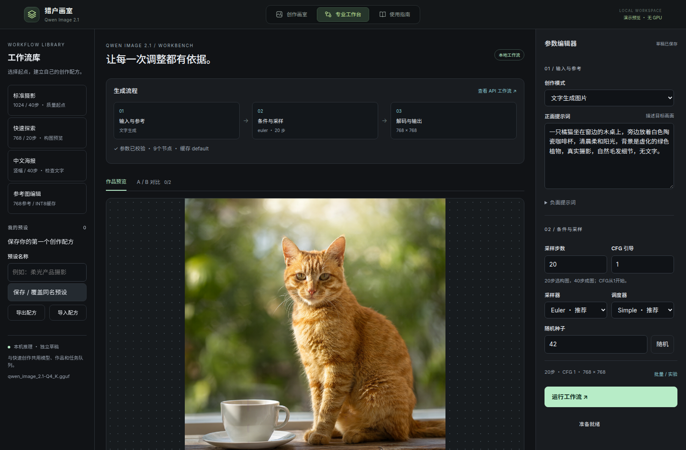

# Orion Image Workbench · 猎户画室

**固定版本：[v0.1.0](https://github.com/orionarch26/orion-image-workbench/releases/tag/v0.1.0)** · [版本说明](docs/releases/v0.1.0.md)。`main` 用于后续开发。

**本地生图、批量创作与可复现的工作流实验。**

[English](README.md) · [安装说明](docs/zh-CN/installation.md) · [专业工作台指南](docs/PRO_GUIDE.md) · [参与贡献](CONTRIBUTING.md)

基于 ComfyUI 的轻量浏览器工作台，首个支持的管线为 **Qwen-Image-2.1**。支持文生图、参考图编辑、透明PNG、连续换种子、单变量实验、A/B细节对比、配方版本与持久任务记录。



使用仓库内合成示例与演示状态重新拍摄，不含个人作品档案。

## 当前版本边界

- **已实测**：Linux、RTX 4070 Laptop 8GB、16GB内存。
- **Windows**：模型下载脚本采用跨平台Python标准库，提供Windows/Linux、Python 3.10 / 3.12测试矩阵；完整应用仍有Linux平台依赖，尚未宣称支持。
- **语言**：当前界面为中文，README与安装说明已有中英文；完整界面i18n在路线图中。
- 这是首个源码版本。模型下载器只安装模型文件，ComfyUI、PyTorch、驱动与节点环境需按安装说明准备。

## 准备好的Linux环境快速使用

前置条件：Git、Python 3.12、兼容NVIDIA驱动，以及安装说明中的 `ComfyUI/.venv` 和节点。首次clone请先阅读[完整安装说明](docs/zh-CN/installation.md)。

```bash
git clone --branch v0.1.0 --depth 1 https://github.com/orionarch26/orion-image-workbench.git
cd orion-image-workbench

# 先按安装说明准备ComfyUI环境，再查看模型清单：
python3 scripts/download_models.py --list

# 下载模型：终端会显示许可链接、目标目录和大小，并询问是否继续。
python3 scripts/download_models.py

# 完整SHA-256检查，不下载：
python3 scripts/download_models.py --check

ComfyUI/.venv/bin/python -m pip install -r requirements-app.lock
./start.sh
```

打开 http://127.0.0.1:7860 或专业页 http://127.0.0.1:7860/pro 。无需托管推理API Key，模型受独立许可约束。

## 模型按需安装

三个模型文件约 **11.19GB（10.42GiB）**，另需后端及Python依赖的磁盘空间。

| 组件 | 文件 | 大小 |
|---|---|---:|
| 生成模型 | `qwen_image_2.1-Q4_K.gguf` | 4.20GB |
| 文本编码器 | `qwen3vl_8b_w4a8.safetensors` | 6.31GB |
| VAE | `qwen_image_2.1_vae_bf16.safetensors` | 0.68GB |

安装到另一个ComfyUI目录：

```bash
python3 scripts/download_models.py --models-dir /path/to/ComfyUI/models
```

Windows PowerShell，仅下载模型文件，需Python 3.10+：

```powershell
py -3 scripts/download_models.py --models-dir 'D:\ComfyUI\models'
py -3 scripts/download_models.py --models-dir 'D:\ComfyUI\models' --check
```

- 后端未启动且默认模型缺失时，交互式 `./start.sh` 会提供下载入口。后端已运行时，通过API检查模型；缺失时给出诊断，不直接改动已有后端。
- 阅读并接受脚本展示的模型许可后，可以加 `--accept-model-license` 进行无交互下载。
- 固定仓库版本、文件大小与SHA-256；已校验文件跳过，下载中断后重新运行续传。
- 已有文件校验不符时停止；明确使用 `--replace-invalid` 后，仍须新文件校验成功才替换旧文件。
- 日常启动检查缺失文件，不每次读取11GB计算哈希；完整校验使用 `--check`。
- 自定义模型不会被默认配置悄悄替换。脚本不会升级ComfyUI、驱动或其他环境。

## 推荐创作流程

1. 从768×768、20步、Euler / Simple、CFG=1开始。
2. 专业页点“批量 / 实验”，选连续换种子，数量3，种子-1。
3. 选中喜欢的作品，载入参数以保留其实际种子。
4. 使用单变量实验比较20 / 30 / 40步，再用A/B检查细节。
5. 保存更适合自己需求的配方。

总活动任务上限为5，两页共享；后端逐张执行。更高步数或更换采样器不保证质量更好。

## 数据与开发

作品和记录在 `output/`，任务库与配方在 `state/`。这些目录、上传图、权重和日志不进入Git。应用只监听本机环回地址，无使用遥测；安装需要访问依赖和模型下载服务。

```bash
python3 -m venv .venv
.venv/bin/python -m pip install -r requirements-test.txt
.venv/bin/python -m unittest discover -s tests -p 'test_*.py'
```

普通测试使用模拟后端，不下载模型、不运行GPU生成。详见[测试说明](docs/testing.md)、[贡献指南](CONTRIBUTING.md)、[路线图](ROADMAP.md)。

独立应用代码采用 [Apache-2.0](LICENSE)。模型采用 [Qwen Research License](https://huggingface.co/Qwen/Qwen-Image-2.1/blob/main/LICENSE)，非商业用途限定研究评估，商业使用需另行许可。上游代码与补丁归属见[第三方声明](THIRD_PARTY_NOTICES.md)。本项目不是Qwen或ComfyUI官方产品。
